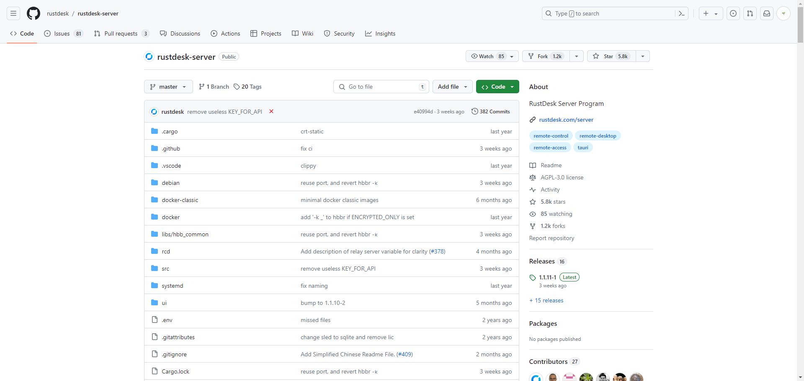

# RustDesk服务器搭建

```
https://github.com/rustdesk/rustdesk-server
```



上服务器，创建目录

```shell
mkdir rustdesk

cd rustdesk

mkdir data

vi docker-compose.yml
```

在rustdesk目录下 创建docker-compose.yml文件

```yml
version: '3'

networks:
  rustdesk-net:
    external: false

services:
  hbbs:
    container_name: hbbs
    ports:
      - 21115:21115
      - 21116:21116
      - 21116:21116/udp
      - 21118:21118
    image: rustdesk/rustdesk-server:latest
    command: hbbs -r [服务器ip或者域名]:21117
    volumes:
      - ./data:/root
    networks:
      - rustdesk-net
    depends_on:
      - hbbr
    restart: unless-stopped

  hbbr:
    container_name: hbbr
    ports:
      - 21117:21117
      - 21119:21119
    image: rustdesk/rustdesk-server:latest
    command: hbbr
    volumes:
      - ./data:/root
    networks:
      - rustdesk-net
    restart: unless-stopped
```

```shell
docker-compose up -d
```


