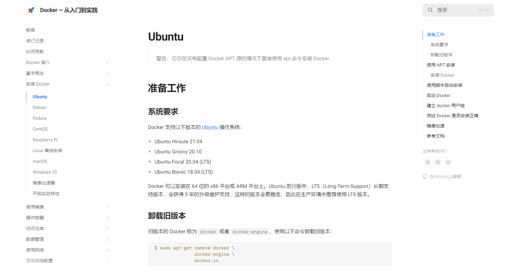

# 使用 APT 安装


```
sudo apt-get update
```

添加使用 HTTPS 传输的软件包以及 CA 证书

```
sudo apt-get install \
    apt-transport-https \
    ca-certificates \
    curl \
    gnupg \
    lsb-release
```

使用国内源

```
curl -fsSL https://mirrors.aliyun.com/docker-ce/linux/ubuntu/gpg | sudo gpg --dearmor -o /usr/share/keyrings/docker-archive-keyring.gpg
```

向 sources.list 中添加 Docker 软件源

```
echo \
  "deb [arch=amd64 signed-by=/usr/share/keyrings/docker-archive-keyring.gpg] https://mirrors.aliyun.com/docker-ce/linux/ubuntu \
  $(lsb_release -cs) stable" | sudo tee /etc/apt/sources.list.d/docker.list > /dev/null
```

安装docker

```
sudo apt-get update
sudo apt-get install docker-ce docker-ce-cli containerd.io
```

配置国内镜像加速器
sudo vi /etc/docker/daemon.json

```
{
    "registry-mirrors" : [
        "https://registry.docker-cn.com",
        "https://docker.mirrors.ustc.edu.cn",
        "http://hub-mirror.c.163.com",
        "https://cr.console.aliyun.com/"
  ]
}
```

重启docker服务

```
sudo systemctl daemon-reload
sudo systemctl restart docker
```

校验加速器是否生效

```
docker info
```

出现以下结果，表明已生效

```
 Registry Mirrors:
  https://registry.docker-cn.com/
  https://docker.mirrors.ustc.edu.cn/
  http://hub-mirror.c.163.com/
  https://cr.console.aliyun.com/
```

以上资料来自：https://yeasy.gitbook.io/docker_practice/install/ubuntu


